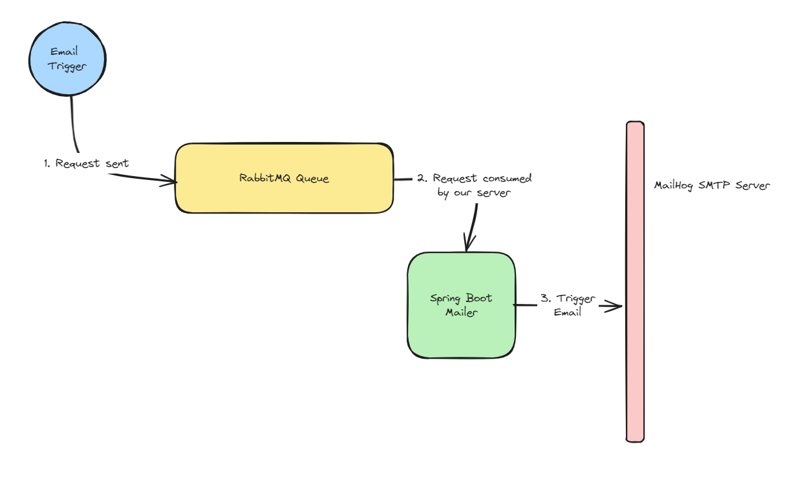
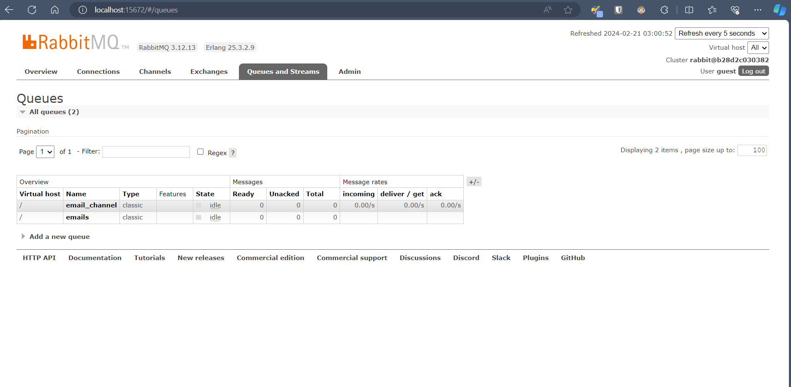
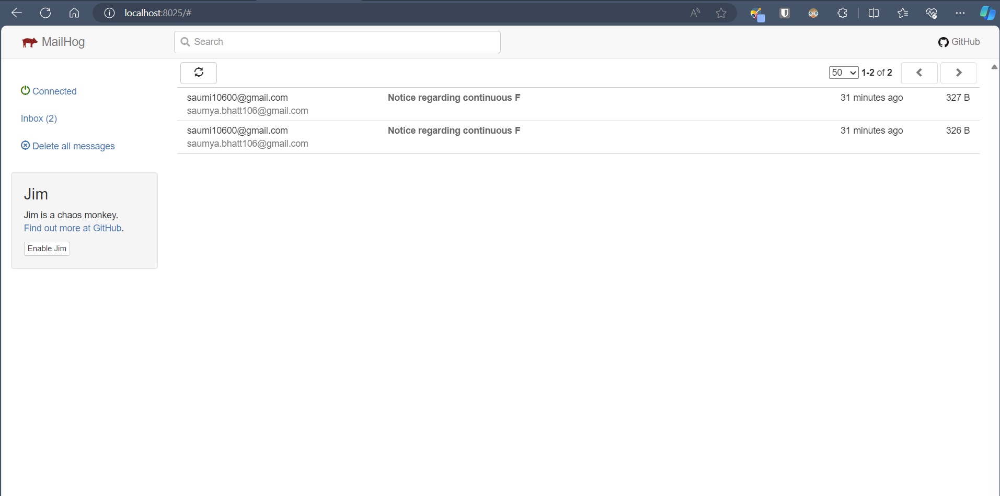

# ESE-Mailer

This is the service that will accept the trigger to send and email. It houses all the necessary services to provide end to end email scheduling and also hosts the SMTP server.



---

## Components

The ESE-Mailer is composed of the following parts:

### RabbitMQ Queue

- For anyone who wishes to trigger an email, they would have to send a message to this queue.
- Stats about the queue available at `http://localhost:15672`

Message format:

```json
{
  "from": "saumi10600@gmail.com",
  "to": "saumya.bhatt106@gmail.com",
  "subject": "Suspicious user alert",
  "content": "User sending multiple stale data"
}
```

**Note:** The queue name on which the mailer will be subscribed to is `email_channel`.



### Spring Boot Mailer

- This is the consumer of the messages from this queue.
- It will do the necessary parsing and trigger the SMTP server to send the email.

### MailHog SMTP Server

- This is a mock SMTP server to send and receive emails.
- The UI for the inbox is hosted at `http://localhost:8025`



---

## Local Set-up

- The RabbitMQ management UI is available at `http://localhost:15672`
- The MailHog Email Inbox UI is available at `http://localhost:8025`

### Using Docker-Compose (Recommended)

The `application.properties` file has been written to provide bias to running the entire setup on a single machine with as little setup required as possible.

This will install the RabbitMQ broker and the MailHog SMTP server on its own. Run the below command to quickly setup all 3 components:

```shell
 docker-compose up -d
```

### Individually building components

- Before running the spring-boot mailer, ensure that the queue and the SMTP server are up and running.

```shell
# starting the Queue
docker run -d --name rabbitmq -p 5672:5672 -p 15672:15672 rabbitmq:3-management

# starting the SMTP server
docker run -d --name mailhog -p 1025:1025 -p 8025:8025 mailhog/mailhog

```

- Make any necessary changes required at `application.properties` file if needed.
- Build and run the `MainRunner.java` file at `src/main/java/` to start the spring-boot-mailer.

```shell
# Build the project
./gradlew clean build

# Run the project
java -jar .\build\libs\mailer-0.0.1-SNAPSHOT.jar 
```

---

## Pushing Image

On merging any PR to master will automatically trigger a push to the `latest` tag. If however any other image tag is to be published, use the below given commands:

[DockerHub Repository](https://hub.docker.com/repository/docker/saumyabhatt10642/ese-mailer/general)

```bash
docker image build -t ese-mailer:tag .
docker image tag ese-mailer:tag saumyabhatt10642/ese-mailer:tag
docker push saumyabhatt10642/ese-mailer:tag
```